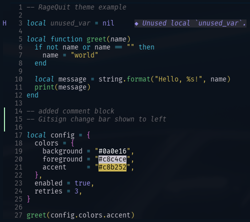

# RageQuit Colors for NeoVim

Color theme for NeoVim to mimic [RageQuit for VS Code](https://marketplace.visualstudio.com/items?itemName=YuriRage.ragequit).




## Installation

Using [Lazy.nvim](https://github.com/folke/lazy.nvim):

```lua
return {
    "yuri-rage/nvim-ragequit-colors",
    config = function()
        require("ragequit").setup({})
    end,
}

```
